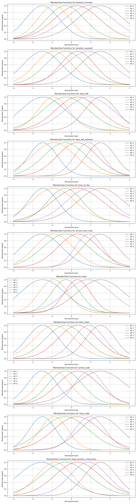
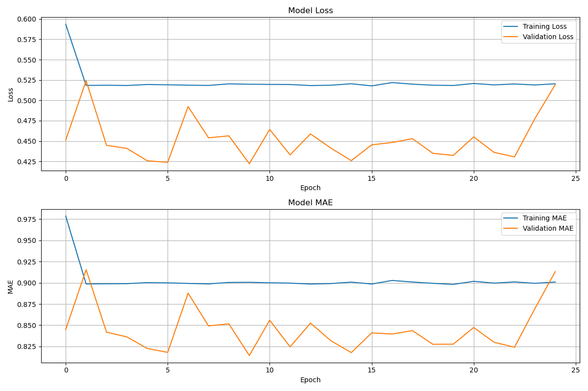
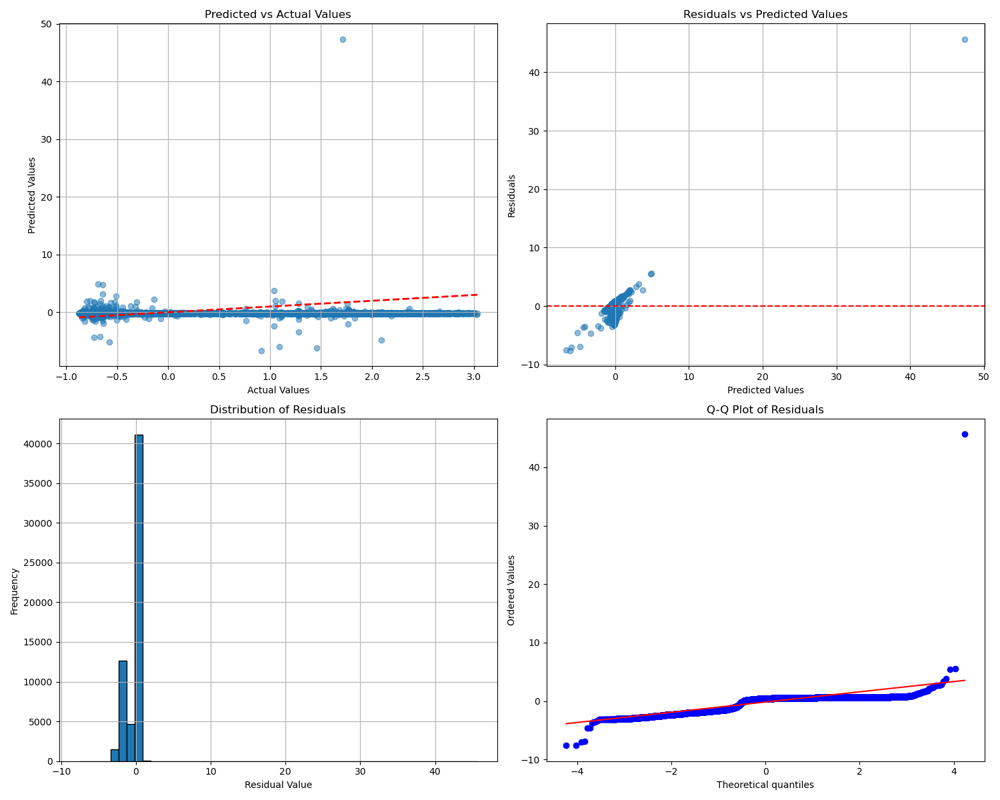
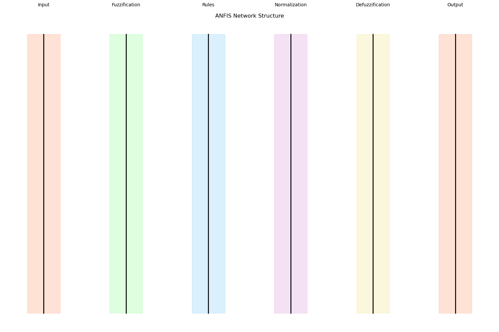
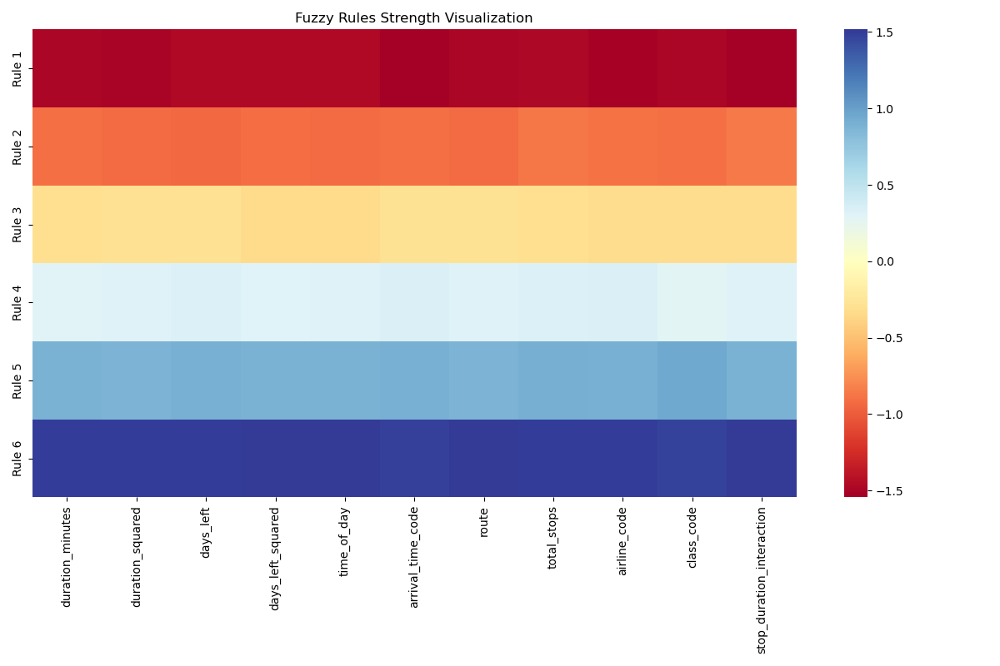

# ANFIS-Powered Flight Price Predictor ✈️

[](https://github.com/YOUR_USERNAME/ANFIS-Flight-Price-Predictor/blob/main/LICENSE)
[](https://www.python.org/)
[](https://www.tensorflow.org/)
[](https://keras.io/)
[](https://github.com/YOUR_USERNAME/ANFIS-Flight-Price-Predictor/blob/main/CONTRIBUTING.md)
[](YOUR_COLAB_NOTEBOOK_LINK_HERE)
[](YOUR_KAGGLE_DATASET_LINK_HERE)

## Predicting Flight Prices with the Power of Adaptive Neuro-Fuzzy Inference Systems (ANFIS)

Ever wished you could predict the perfect time to book a flight? This repository houses a sophisticated flight price prediction model built upon the **Adaptive Neuro-Fuzzy Inference System (ANFIS)**. By seamlessly blending the interpretability of fuzzy logic with the learning prowess of neural networks, this project offers a unique approach to forecasting airfare.

## Project Overview

This project leverages the **ANFIS architecture** to model the complex relationships between various flight features and their prices. Unlike traditional machine learning models that can act as black boxes, ANFIS provides insights into the decision-making process through its fuzzy rules and membership functions.

**Key Concepts of ANFIS:**

*   **Fuzzy Logic:**  Employs linguistic variables and fuzzy sets to represent uncertain or imprecise information, mimicking human-like reasoning.
*   **Neural Networks:** Utilizes a layered structure to learn intricate patterns from data through adjustable weights and biases.
*   **Membership Functions:** Define the degree to which an input belongs to a fuzzy set (e.g., "short duration," "long duration").
*   **Fuzzy Rules:**  Represent "if-then" statements that link input fuzzy sets to output fuzzy sets.
*   **Adaptive Learning:**  The ANFIS network adjusts its parameters (membership function parameters, rule weights) during training to minimize prediction errors.

This implementation provides a clear and structured way to understand and utilize ANFIS for regression tasks, specifically tailored for flight price prediction.

## Key Features

*   **Pure ANFIS Implementation:**  A from-scratch implementation of the ANFIS architecture using TensorFlow/Keras.
*   **Gaussian Membership Functions:** Utilizes Gaussian functions for smooth and interpretable fuzzy sets.
*   **Customizable Architecture:** Easily modify the number of membership functions and other hyperparameters.
*   **Comprehensive Data Preprocessing:** Includes robust feature engineering and scaling techniques to prepare flight data for the model.
*   **Detailed Visualizations:** Provides insightful plots of membership functions, training history, and prediction analysis.
*   **Performance Evaluation:**  Comprehensive evaluation metrics including R-squared, MAE, RMSE, and MAPE.
*   **Modular Design:**  Well-organized code into separate modules for easy understanding and modification.
*   **Clear Documentation:**  Detailed comments and explanations within the code.
*   **Ready for Kaggle:** Includes a Jupyter notebook tailored for Kaggle environments.

## Getting Started

Follow these steps to get the project up and running on your local machine.

### Prerequisites

Make sure you have Python 3.7 or higher installed. You'll also need to install the required libraries. You can install them using pip:

```bash 
pip install -r requirements.txt
```

```bash 
pip install tensorflow pandas numpy scikit-learn matplotlib seaborn scipy
```

### Installation

Clone the repository:

```bash
git clone https://github.com/YOUR_USERNAME/ANFIS-Flight-Price-Predictor.git
cd ANFIS-Flight-Price-Predictor
```

(Optional) Create a virtual environment:

```bash
python -m venv venv
source venv/bin/activate  # On Linux/macOS
# venv\Scripts\activate  # On Windows
```

Install the dependencies:

```bash
pip install -r requirements.txt
Use code with caution.
```

### Data

1 - Download the Clean_Dataset.csv file from the Flight Price Prediction dataset on Kaggle.

2 - Place the downloaded Clean_Dataset.csv file in the data/raw/ directory.

## Usage

To train and evaluate the ANFIS model, run the main script:

```bash
python src/main.py
```

This script will:

- Load and preprocess the flight price data.
- Split the data into training and testing sets.
- Create and train the ANFIS model.
- Evaluate the model's performance on the test set.
- Generate visualizations of membership functions, training history, and prediction analysis.

You can also explore the Jupyter notebook notebooks/ANFIS_Flight_Price_Prediction.ipynb for a step-by-step walkthrough and interactive analysis.

## Model Architecture

The ANFIS model implemented in this project follows a five-layer architecture:

1 - Fuzzy Layer: Computes the membership degrees of the input features using Gaussian membership functions.

```python
# Example of the Fuzzy Layer
class FuzzyLayer(keras.layers.Layer):
    # ... implementation ...
```

2 - Rule Layer: Calculates the firing strength of each rule by taking the product of the membership degrees.
```python
# Example of the Rule Layer
class RuleLayer(keras.layers.Layer):
    # ... implementation ...
```

3 - Normalization Layer: Normalizes the firing strengths of the rules.

```python
# Example of the Normalization Layer
class NormLayer(keras.layers.Layer):
    # ... implementation ...
```

4 - Defuzzification Layer: Computes the weighted consequent of each rule.

```python
# Example of the Defuzzification Layer
class DefuzzLayer(keras.layers.Layer):
    # ... implementation ...
```

5 - Summation Layer: Aggregates the outputs of the defuzzification layer to produce the final predicted price.

```python
# Example of the Summation Layer
class SummationLayer(keras.layers.Layer):
    # ... implementation ...
```

## Performance

The model's performance is evaluated using several metrics. Here are some typical results you can expect:

- R-squared (R2): [Insert R2 Score]
- Mean Absolute Percentage Error (MAPE): [Insert MAPE Score]%
- Root Mean Squared Error (RMSE): [Insert RMSE Score]
- Mean Absolute Error (MAE): [Insert MAE Score]

Example Visualizations:

Membership Functions:


Training History:


Prediction Analysis:


ANFIS Structure:


Fuzzy Rules:


## Contributions
Contributions are welcome! If you find any issues or have suggestions for improvements, please feel free to open an issue or submit a pull request. Check out our Contribution Guidelines for more details.

## License
This project is licensed under the MIT License - see the LICENSE file for details.

## Acknowledgements

- The Flight Price Prediction dataset provided by Shubham Bathwal.
- The TensorFlow and Keras libraries for providing the building blocks for this implementation.
- Inspiration and resources from the research community on Adaptive Neuro-Fuzzy Inference Systems.
